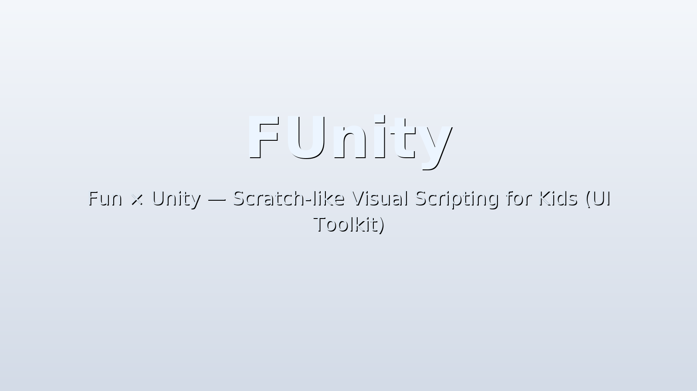

# FUnity — Fun × Unity

> UI Toolkit ベースの Scratch 風学習環境で、子どもたちの創造力を引き出す。



## 📦 パッケージ構成と配置ルール
- `Runtime/` — ランタイム C#。**すべての実装はここに置き、`Assets/FUnity/Runtime/` へは置かない。**
- `Editor/` — エディタ拡張。ガードやメニュー、ウィザードなどを配置。
- `Art/`・`Docs/`・`Samples~` — アセット、ドキュメント、サンプルを格納。
- `Assets/FUnity/**` — プロジェクト同梱の検証用アセット。ランタイムコードは配置禁止で、混入すると Editor/CI ガードがエラーを報告します。

## ⚙ Modes
- `FUnityProjectData` アセットの Inspector で Scratch モードと unityroom モードを切り替えられます。
- 選択したモードに応じて `FUnityProjectData` 内の ModeConfig 参照がランタイム起動時に自動適用されます。
- 各モードの仕様やブロック互換ポリシーは [`Assets/FUnity/Docs/Modes/README.md`](Assets/FUnity/Docs/Modes/README.md) を参照してください。

## 現状機能サマリ
- UPM の Git URL（`https://github.com/oco777/FUnity.git`）で導入可能。タグ指定（例：`#v0.1.0`）によるバージョン固定にも対応。
- Samples~/BasicScene 内の **FUnitySample.unity** を開いて、ワンコマンド（**FUnity/Create/FUnityProjectData**）で初期データを生成。
- `Runtime/Resources/Backgrounds/Background_01.png` と `FUnityActorData_Fooni` を自動設定し、背景とフーニーが 5 分で表示される。
- `FUnityManager` がシーン起動時に “FUnity UI” GameObject と `UIDocument` を構築し、UI ブリッジや Runner 参照をセットアップ。
- Unity Visual Scripting を **必須依存**とし、Macro が無い場合でも `Fooni_FloatSetup.asset` を自動生成して割り当てる。
- Scratch 互換の見た目操作として「大きさを ◯ % にする」「大きさを ◯ % ずつ変える」ユニットを提供し、Presenter 経由で UI Toolkit `style.scale` を中心ピボットで適用。

## 目次
- [システム要件](#システム要件)
- [インストール（UPM/Git）](#インストールupmgit)
- [クイックスタート](#クイックスタート)
- [FUnityProjectData が行うこと](#funityprojectdata-が行うこと)
- [ランタイム構築フロー](#ランタイム構築フロー)
- [⚙ Modes](#-modes)
- [Visual Scripting での移動例](#visual-scripting-での移動例)
- [トラブルシューティング早見表](#トラブルシューティング早見表)
- [ドキュメント](#ドキュメント)
- [ライセンス](#ライセンス)
- [貢献方法](#貢献方法)

## システム要件
- Unity 6 (6000.x) 以降。
- .NET Standard 2.1 互換ランタイム。
- UI Toolkit / UI Builder。
- Unity Visual Scripting 1.9.7 以降（FUnity の依存として自動追加される）。

## インストール（UPM/Git）
### Git URL を直接指定する場合
`Packages/manifest.json` の `dependencies` に次のエントリを追加します。

```json
"com.papacoder.funity": "https://github.com/oco777/FUnity.git"
```

### バージョンを固定したい場合
特定のタグに固定したい場合は、`#タグ名` を付けます。

```json
"com.papacoder.funity": "https://github.com/oco777/FUnity.git#v0.1.0"
```

> ℹ️ Visual Scripting は必須依存のため、`#if UNITY_VISUAL_SCRIPTING` などのガードは不要です。パッケージ導入時に `com.unity.visualscripting` が自動インストールされます。

## クイックスタート
1. Package Manager を開き、**Samples → BasicScene** の **Import** を押して `Samples~/BasicScene/FUnitySample.unity` を開きます。
2. メニュー **FUnity/Create/FUnityProjectData** を実行し、プロジェクト既定データを生成します。
3. シーンを再生すると背景画像（`Background_01.png`）とフーニーの俳優 UI が表示され、サンプル Macro による移動が動作します。

## Scratch本で最初に試すレシピ（5分）
- **FUnity/Create/FUnityActorData** を実行すると、ActorData と関連テンプレートが規定のフォルダに生成され、Stage や Runner を既存プロジェクトへ手早く追加できます。
  - 生成した `FUnityActorData` には `ActorElement.uxml/uss` と吹き出し用ラベルが割り当て済みで、`StageBackgroundService` と組み合わせて背景を適用できます。
  - Runner は必要に応じて既存のテンプレートを複製し、`ScriptMachine` に Macro を割り当てて Visual Scripting グラフを編集してください。
- Visual Scripting のグラフは Runner の `ScriptMachine` から新規 Macro を作成し、`VSPresenterBridge` の Custom Event を結線すると Scratch ブロック相当の操作が行えます。

## FUnityProjectData が行うこと
メニュー **FUnity/Create/FUnityProjectData**（`Assets/FUnity/Editor/CreateProjectData.cs` 内）を実行すると、既存リソースを尊重しつつ以下が保証されます。
- `Resources/FUnityProjectData.asset` と `Resources/FUnityStageData.asset` を生成し、ステージ背景に `Runtime/Resources/Backgrounds/Background_01.png` を設定。
- `Assets/UI Toolkit/UnityThemes/UnityDefaultRuntimeTheme.uss` が存在する場合はそれを `FUnityPanelSettings.asset`（`Assets/FUnity/UI/`）の ThemeStyleSheet に割り当て。存在しなければ `Assets/FUnity/UI/USS/UnityDefaultRuntimeTheme.uss` を生成し、同アセットに設定。
- `Assets/FUnity/Data/Actors/FUnityActorData_Fooni.asset` を作成し、既存の重複リソース（`Assets/Resources/FUnityActorData_Fooni.asset` など）を検出して削除。Portrait/UXML/USS を既定テンプレートに割り当てます。
- `Assets/FUnity/VisualScripting/Macros/Fooni_FloatSetup.asset` を探索し、無ければ新規作成。生成した Macro を `FUnityActorData_Fooni` の ScriptGraph に登録します。

## ランタイム構築フロー
- シーンに `FUnityManager` を 1 体置くだけで、再生開始時に “FUnity UI” GameObject と `UIDocument` を生成。
- `FUnityManager` は `FUnityProjectData` を参照して各 Actor Runner を生成し、Runner 側の `ScriptMachine` と `ActorPresenterAdapter` を構成しつつ、`FooniUIBridge` や `VSPresenterBridge` など必要なコンポーネントを結線します。
- Actor ごとに `FUnityActorData` に設定された Macro が `ScriptMachine` に割り当てられ、`ActorPresenter` が `ActorState` と `ActorView` を橋渡しします。
- Visual Scripting を用いず C# だけで動作させたい場合も、Presenter 層でロジックを完結させることで UI 更新と分離できます。

## Visual Scripting での移動例
- サンプル Macro（`Fooni_FloatSetup`）では、`On Update` → `Get Axis (Horizontal/Vertical)` → `Vector2`（Y を `*-1` で反転）→ `FooniUIBridge.NudgeByDefaultSpeed(dir, deltaTime)` の流れで移動量を計算します。
- 入力 API は `FUnity.Runtime.Input` と `UnityEngine.Input` の名前空間が衝突しやすいため、`UnityEngine.Input.GetAxisRaw` のように完全修飾呼び出しを推奨します。

## トラブルシューティング早見表
- `CS0234`（`Input.GetAxisRaw` が見つからない）: `UnityEngine.Input.GetAxisRaw` と完全修飾するか、`using UInput = UnityEngine.Input;` を追加します。
- テーマが null のまま: `Assets/UI Toolkit/UnityThemes/` を確認し、存在しない場合は **FUnity/Create/FUnityProjectData** を再実行して `Assets/FUnity/UI/USS/UnityDefaultRuntimeTheme.uss` が生成されることを確認します。
- 俳優 UI が表示されない: `FooniElement.uxml` で `name="root"` と `name="actor-root"` が設定されているか確認し、`FooniUIBridge` が要素を取得できるようにします。

## ドキュメント
- [導入手順](Docs/setup.md)
- [既定データの構成](Docs/data-defaults.md)
- [UI テーマ適用戦略](Docs/ui-theme.md)
- [トラブルシュート集](Docs/troubleshooting.md)
- [MVP アーキテクチャ概要](Docs/mvp-overview.md)

## ライセンス
- 本プロジェクトは [MIT License](LICENSE.md) に従います。

## 貢献方法
- Issue と Pull Request を歓迎します。まずは課題を記載し、再現手順・スクリーンショットを添付してください。
- コーディング規約とコメント方針は [Docs/conventions.md](Docs/conventions.md) を参照してください。
