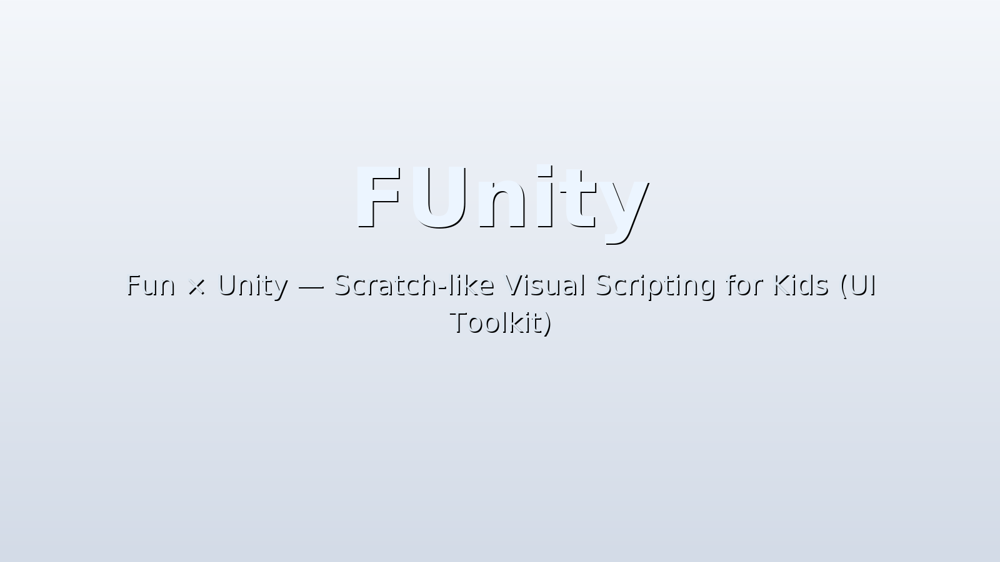

# FUnity — Fun × Unity

> UI Toolkit ベースの Scratch 風学習環境で、子どもたちの創造力を引き出す。



> TODO: スクリーンショットを差し替える。

## 目次
- [プロジェクト概要](#プロジェクト概要)
- [システム要件](#システム要件)
- [インストール方法](#インストール方法)
- [クイックスタート](#クイックスタート)
- [自動生成されるアセット](#自動生成されるアセット)
- [UI テーマ適用戦略](#ui-テーマ適用戦略)
- [アクター UI テンプレート](#アクター-ui-テンプレート)
- [トラブルシュート](#トラブルシュート)
- [既知の制限と今後の予定](#既知の制限と今後の予定)
- [ドキュメント](#ドキュメント)
- [ライセンス](#ライセンス)
- [貢献方法](#貢献方法)

## プロジェクト概要
- FUnity は Unity と UI Toolkit を用いたビジュアルプログラミング学習環境。
- Create → Default Project Data で学習用の舞台・俳優・UI を一括生成する。
- PanelSettings と Theme を安全に初期化し、実行時の見た目をすぐ確認できる。
- ランタイムでは **FUnityManager** が `FUnity UI` GameObject と UIDocument を生成し、UI 初期化を一手に引き受ける。
- Visual Scripting 1.9.7+ を前提とし、VS グラフから FUnity のアクターを直接制御できる。

## システム要件
- Unity 6 (6000.x) 以降。
- .NET Standard 2.1 互換ランタイム。
- UI Toolkit / UI Builder パッケージ。
- Unity Visual Scripting 1.9.7 以降（FUnity の依存関係として自動導入される）。

## インストール方法
### Unity Package Manager (Git URL)
- `Packages/manifest.json` の `dependencies` に次を追加する。

```json
"com.papacoder.funity": "https://github.com/oco777/FUnity.git"
```

> ℹ️ Visual Scripting パッケージ（`com.unity.visualscripting`）は FUnity の依存関係として自動的に導入されます。

### Git Submodule
- 既存プロジェクトのルートで次を実行する。

```bash
git submodule add https://github.com/oco777/FUnity.git Packages/com.papacoder.funity
```

### パッケージ参照
- 任意の Git タグやコミットを `.tgz` として取得し、`manifest.json` へファイル参照を追加する。
- 例：

```json
"com.papacoder.funity": "file:../packages/FUnity-0.2.0.tgz"
```

## クイックスタート
### サンプルシーンの再生
- Package Manager → Samples → **FUnitySample** をインポートする。
- `Assets/FUnity/Samples/FUnitySample.unity` を開き再生する。
- シーンには **FUnityManager** だけを配置しておけばよく、再生開始時に FUnityManager が `FUnity UI` GameObject と UIDocument を自動生成する。追加の初期化コンポーネントは不要で、旧来の `WorkspaceHUD` は利用しない。
- 再生すると背景（`Background_01`）とフーニーの俳優 UI が表示される。ブロック UI は現行パッケージには含まれず、今後の拡張候補として扱う。
- 実行時に FUnityManager が `ScriptMachine` と `FooniUIBridge` を `FUnity UI` に自動付与し、サンプルの Visual Scripting グラフでフーニーを移動できる。
- ProjectData に登録された Actor ごとに `ActorRunner - <Actor名>` GameObject が `FUnity UI` 配下に生成され、ActorData の **ScriptGraph** に設定した Macro が ScriptMachine に割り当てられる。ScriptGraph が空の場合は警告ログのみで生成は継続する。

### ランタイムアーキテクチャ（MVP）
- **Model**：`FUnityProjectData` / `FUnityActorData` などの ScriptableObject が静的設定を提供し、`ActorState` が実行中の位置・速度を保持する。
- **View**：`ActorView`（UI Toolkit 専用の薄い MonoBehaviour）が `FooniUIBridge` を通じて UI の `left/top` を更新し、描画のみに責務を限定する。
- **Presenter**：`ActorPresenter` が入力ベクトルを `ActorState` に反映し、`IActorView` 経由で UI を更新。入力取得は `InputPresenter` に分離し、Visual Scripting からは `VSPresenterBridge.VS_Move(dir, dt)` を呼び出す。
- **Composition Root**：`FUnityManager` が ScriptableObject を読み込み、UI を生成し、各 Presenter/State/View を束ねて `Update()` 内で `Tick()` を呼ぶ。詳しくは [Docs/mvp-overview.md](Docs/mvp-overview.md) を参照。

### 既定データの生成
- メニュー **FUnity → Create → Default Project Data** を選ぶ。
- 次のアセットが `Assets/FUnity/` 配下に生成される。
  - `Data/Project/FUnityProjectData.asset`
  - `Data/Stages/FUnityStageData.asset`（背景に `Art/Backgrounds/Background_01.png` を適用）
  - `Data/Actors/FUnityActorData_Fooni.asset`
  - `UI/FUnityPanelSettings.asset`
  - `UI/USS/UnityDefaultRuntimeTheme.uss`
- 生成後にシーンを再生すると PanelSettingsInitializer が Theme を割り当てる。
- FUnityManager はこれらのデータを参照しつつ、実行時に `FUnity UI`（UIDocument 付き）を自動生成して最小構成の背景とフーニーを表示する。

## 自動生成されるアセット
- `CreateProjectData.CreateDefault()` が Stage 背景・俳優・PanelSettings を初期化する。
- StageData は `Background_01.png` を参照し、背景が未設定でも最小構成で表示する。
- ActorData は Portrait/UXML/USS を候補パス優先＋探索で決定する。
- PanelSettings は Editor 実行時に自動生成され、Theme を割り当て済みで保存される。

## UI テーマ適用戦略
- UI Builder 標準の `Assets/UI Toolkit/UnityThemes/Unity Default Runtime Theme.uss` を最優先で利用する。
- 上記が無い場合は `Assets/FUnity/UI/USS/UnityDefaultRuntimeTheme.uss` を生成し、最小限のスタイルを提供する。
- `PanelSettingsInitializer.EnsurePanelSettings()` が Editor 実行時に `Resources/FUnityPanelSettings.asset` を配置し Theme を設定する。
- ビルドに含める場合は Editor で生成された Theme アセットをプロジェクトに保持する。

## アクター UI テンプレート
- 俳優 UI は UXML の A 案（`name="root"` と `name="portrait"`）を前提とする。
- `CreateActorElement()` が `name="root"` のサイズ調整と `name="portrait"` の画像差し替えを行う。
- Portrait 画像は `Assets/FUnity/Art/Characters/` の PNG を推奨する。
- USS は `Assets/FUnity/UI/USS/` に保存し、アセット化した Theme から参照する。

## トラブルシュート
- USS の `Unsupported selector format: '---'` が出たら Theme USS を削除し、メニューから再生成する。
- Theme 名の表記ゆれ（`Unity Default Runtime Theme.uss` と `UnityDefaultRuntimeTheme.uss`）は `FUnity/UI/USS/` 配下を採用する。
- Actor や Theme のアセットが重複した場合は Legacy フォルダを削除して一元管理する。

## 既知の制限と今後の予定
- UI Builder 依存アセットは Editor でのみ生成されるため、CI での自動生成は未対応（TODO）。
- 俳優テンプレートのカスタム差し替え例を Docs に追加予定（TODO）。
- ブロック UI / ビジュアルスクリプティング機能は未提供（拡張候補、教材化を検討中）。

## ドキュメント
- [環境構築ガイド](Docs/setup.md)
- [UI テーマ適用戦略](Docs/ui-theme.md)
- [既定データの構成](Docs/data-defaults.md)
- [俳優 UI テンプレート](Docs/actor-template.md)
- [トラブルシュート集](Docs/troubleshooting.md)
- [コーディング規約](Docs/conventions.md)
- [FAQ](Docs/faq.md)
- [MVP アーキテクチャ概要](Docs/mvp-overview.md)

## ライセンス
- 本プロジェクトは [MIT License](LICENSE.md) に従う。

## 貢献方法
- Issue と Pull Request は歓迎する。
- `.github/ISSUE_TEMPLATE/documentation.md` を使い、再現手順とスクリーンショットを添付する。
- コーディング規約と UNITY_EDITOR ガードの方針は [Docs/conventions.md](Docs/conventions.md) を参照する。
